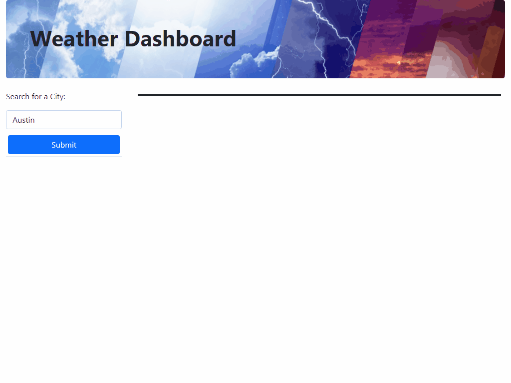

# Welcome to Weather Dashboard

## Purpose
An app that allows the user to look up a city of their choice and gets the current weather for that city as well as the extended 5 day forecast. Included in the forecast is the Temperature, Humidity, Wind Speed, and UV Index. Depending on the UV Index rating, the output is color coded to indicate which level the index is rated at (low, medium, high). The application was made using OpenWeatherMap API to gather the weather data needed to populate the page.

## Created with
* Bootstrap
  * Base HTML/CSS framework
* jQuery
  * Dynamically update the DOM with new elements depending on user input
  * Adjust the screen on mobile devices rather than using media queries in CSS
* OpenWeatherMap API (https://openweathermap.org/api)

## Live Website
https://weingeoffrey.github.io/weather-dashboard/

## Screenshots/Gifs
>>
